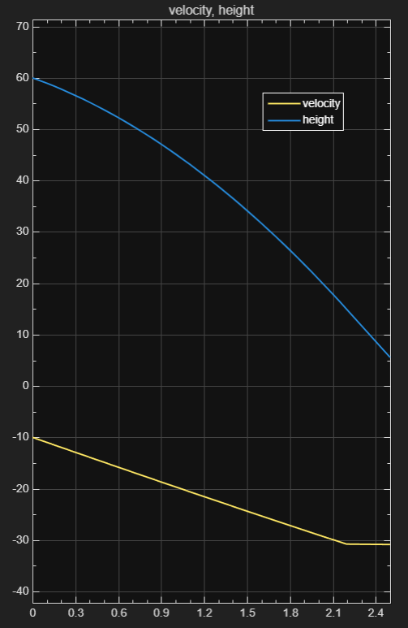

# Peregrine Falcon Flight Model – Simulink

This repository contains a MATLAB Simulink model that simulates the stoop dive of the **Peregrine Falcon**, the fastest bird on Earth. The model calculates the bird’s velocity and altitude during freefall, accounting for aerodynamic drag and gravity.

## 🛠 Features
- Realistic drag modeling with conditional switching (low ↔ high drag)
- Continuous velocity and height tracking
- MATLAB Online + Simulink implementation

## 📊 Output

*Velocity and height vs. time, from the Simulink Scope block*

## 📁 Files Included
- `Peregrine_Falcon_Model.slx` – Main Simulink model
- `README.md` – Project overview
- `scope_output.png` – Simulation graph

## 📌 Requirements
- MATLAB R2025a
- Simulink toolbox

## 🧠 Author
**Akshat Gupta**  
[LinkedIn Profile](www.linkedin.com/in/akshat-gupta-9b649a378)  
